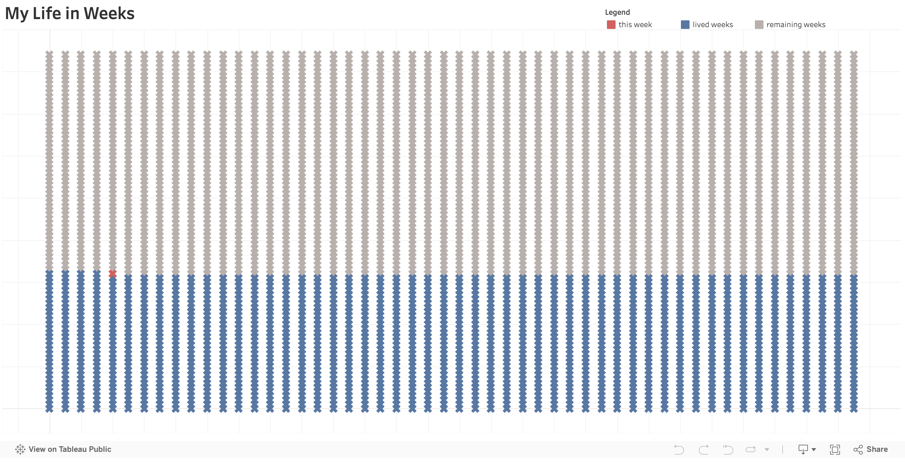

# Life in Weeks Visualization

This project creates a visualization of my life in weeks (updated weekly), inspired by the article ["How to Visualize the Rest of Your Life"](https://medium.com/towards-data-science/how-to-visualize-the-rest-of-your-life-28f943b1f70b) by Dr. Gregor Scheithauer. The visualization represents each week of your life as a cross, with:
- Blue crosses representing weeks I've lived
- Grey crosses representing weeks remaining
- A red cross indicating the current week

## Project Overview

This project extends the original concept by:
1. Creating an interactive visualization using Python and Altair
2. Generating a CSV file for Tableau integration
3. Automatically uploading the CSV to Google Drive
4. Enabling a live connection to Tableau Public

## Technical Setup

### Prerequisites
- Python 3.x
- Virtual environment (recommended)
- Google Cloud Console account
- Tableau Desktop (for development)
- Tableau Public account (for publishing)

### Dependencies
```bash
pip install pandas numpy altair google-auth google-auth-oauthlib google-auth-httplib2 google-api-python-client
```

### Google Cloud Setup
1. Create a project in Google Cloud Console
2. Enable the Google Drive API
3. Create OAuth 2.0 credentials
4. Download credentials and save as `credentials.json` in project directory
5. Add your Google account as a test user in OAuth consent screen

## Project Structure
```
life-in-weeks/
├── life.py                 # Main script for visualization and data generation
├── gdrive_upload.py        # Google Drive upload functionality
├── update_life_weeks.sh    # Shell script for automated updates
├── credentials.json        # Google Cloud credentials (not in repo)
├── graphs/                 # Output directory
│   ├── output.html        # Altair visualization
│   └── life_in_weeks.csv  # Data file for Tableau
└── README.md              # This file
```

## Features

### Python Script (`life.py`)
- Calculates weeks lived and remaining based on birth date and life expectancy
- Generates an interactive visualization using Altair
- Creates a structured CSV file with detailed week information

### Google Drive Integration (`gdrive_upload.py`)
- Authenticates with Google Drive API
- Automatically uploads CSV file
- Creates/updates public sharing link
- Enables live data connection for Tableau Public

### Automated Updates (`update_life_weeks.sh`)
- Shell script for running weekly updates
- Manages virtual environment activation
- Handles script execution and environment cleanup

## Tableau Integration

### Local Development
1. Open Tableau Desktop
2. Connect to Web Data (Google Drive CSV URL)
3. Create visualization using:
   - Week (Columns)
   - Year (Rows)
   - Label (Color)
   - Square mark type

### Tableau Public Publishing
Since Tableau Public has limitations on live data connections, this project uses Google Drive as an intermediary:
1. CSV is automatically uploaded to Google Drive
2. Tableau Public connects to the Google Drive URL
3. Dashboard refreshes automatically when source file updates

## Automation Setup

To set up automatic weekly updates:

1. Make the shell script executable:
```bash
chmod +x update_life_weeks.sh
```

2. Add to crontab (runs every Sunday at midnight):
```bash
0 0 * * 0 cd /path/to/life-in-weeks && ./update_life_weeks.sh
```

## Customization

Edit `life.py` to modify:
- Birth date
- Life expectancy
- Visualization parameters
- Color scheme

## Security Notes

- Keep `credentials.json` secure and never commit to version control
- The Google Drive file is publicly readable but not writable
- OAuth credentials are stored locally in `token.pickle`

## Contributing

Feel free to fork this project and submit pull requests for improvements or bug fixes.

## Dashboard Live in Tableau Public

My life in weeks visualization is available on Tableau Public:
- [View the live dashboard](https://public.tableau.com/app/profile/wilson.teng7303/viz/MyLifeinWeeks_17384989280950/Dashboard1)



## Acknowledgments

- Inspired by Dr. Gregor Scheithauer's Medium article
- Inspired also by Karolina Grodzinska's Tableau Public viz (https://public.tableau.com/app/profile/karolina.grodzinska/viz/Mylifeinweeks/Dashboard1)
- Built with Python, Altair, and Google Cloud Platform
- Visualization powered by Tableau Public 